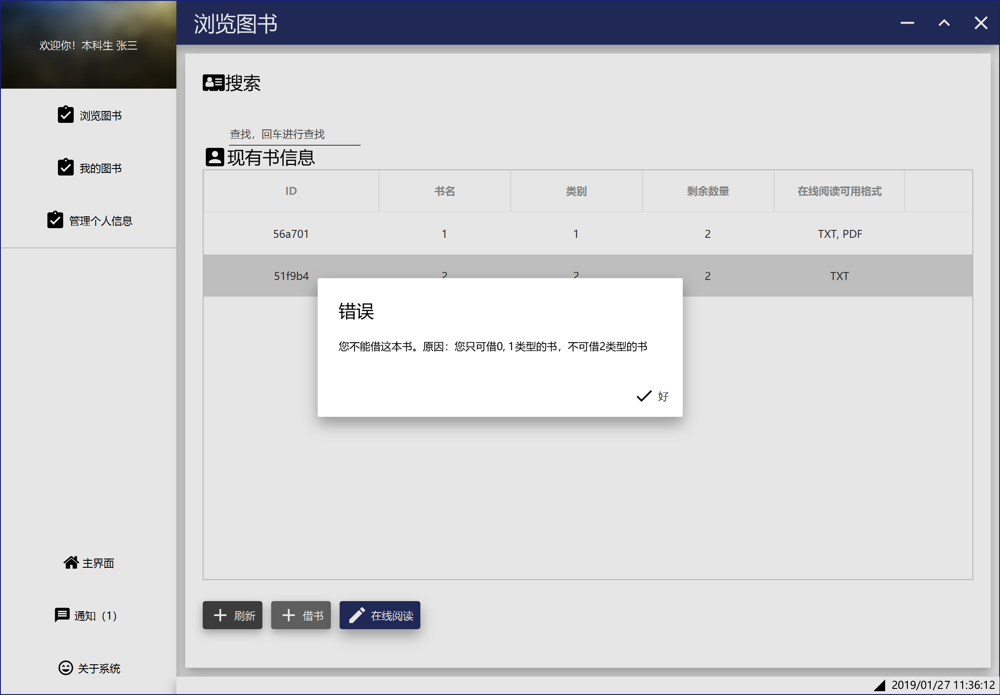
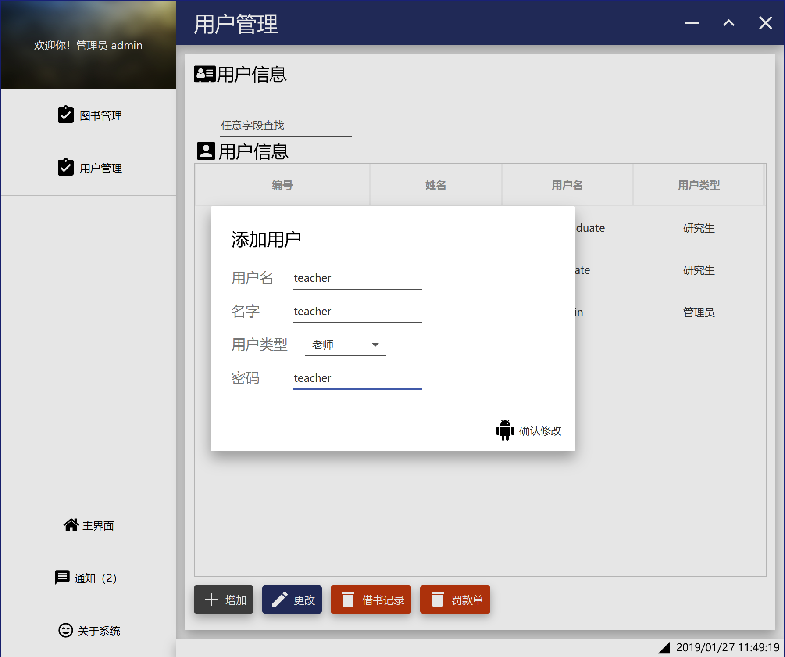

# 用户文档

## 初始数据

本项目的可执行文件存放在app目录下，请运行app/project-jfx.jar运行本系统。运行本系统需要Java 8运行时支持。

本项目使用JVM内置序列化机制保存和存储数据，数据存放在jar文件所在目录下的data目录中（即与jar文件同级的data目录下）。

若系统没有发现data目录、或没有发现目录下的文件、或文件有误，则会**初始化2个新的空文件，不包含以下初始数据！**。

项目提交包中已经包括了初始数据，若要恢复初始数据，**请将提交包中的app/data目录复制并覆盖到jar文件所在目录下**。

### 用户

| 用户名 | 密码 | 角色 | 最长可借天数 | 可借书类别 | 同一时间最大可借数量 |
| -- | -- | -- | -- | -- | -- |
| undergraduate | undergraduate | 本科生 | -1天（用来测试计算逾期款）| 1  | 1 |
| graduate | graduate | 研究生 | 15天 | 1和2 | 2 |
| admin | admin | 管理员，不能进入借书界面。 | N/A | N/A | N/A |

### 书

| 书名 | 类别 | 可用电子档 | 库存 |
| -- | -- | -- | -- |
| 1 | 1 | PDF和TXT | 2 |
| 2 | 2 | TXT | 2 |

## 登录

## 本科生

### 浏览图书

### 借书

#### 借书成功

#### 借书失败

- 无权限借书

  

- 已借书达到最大数量

  

- 该书无剩余

  

###在线阅读

- Txt格式

- PDF格式

### 已借图书

- 还书

### 修改个人信息

## 管理员

### 查看通知

- 其他用户修改个人信息后发送的通知

### 管理图书

- 编辑图书

### 管理用户

- 搜索用户

  

#### 增加用户

- 增加用户

  

- 增加用户结果

  

- 登录新增加用户账号

  

  

#### 编辑用户信息

- 编辑用户信息

  

- 编辑用户信息结果

  

####查看用户借书报告

  

####查看用户罚款单

